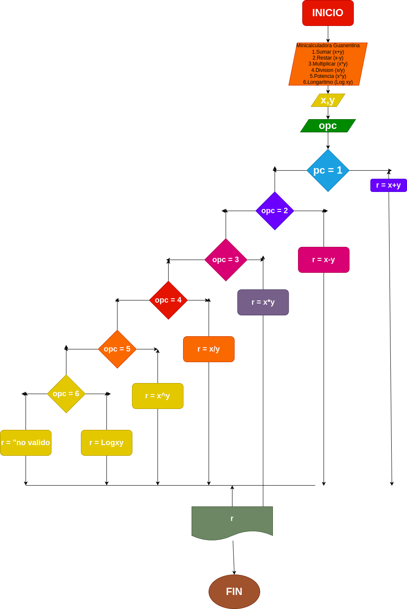

# Analisis
## Input
operacion matematica que desea realizar (suma, resta, multiplicacion, division, potencia o logaritmo).

### Variables de entrada

x : primer numero de la operaciones

y : segundo numero de la operacion

opc: numero correspondiente a las diferentes operacion posibles

### Processing
opc: numero correspondiente de las diferentes operaciones posibles

### output
x,y

# Diseño

# Construccion